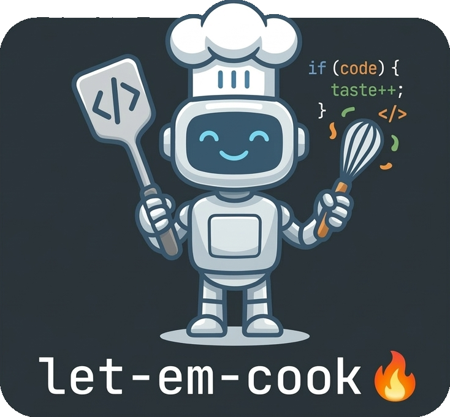

<p align="center">
  <a href="https://github.com/simonepri/let-em-cook"></a>
</p>
<p align="center">
</p>
<p align="center">
  🤌🏻 Teach AI how to cook (code) the way I like it.
</p>

## Synopsis

Out of the box, AI writes bland code — generic, safe, unseasoned. This repo encodes engineering taste and development workflows so any AI coding assistant follows my style.

## Philosophy

AI is already smart. What it lacks is _taste_ — your preferences, your reasoning style, your workflow. This repo teaches it three things:

1. **Principles** — code style priorities, what good looks like, what to avoid
2. **Reasoning** — how to think about any change: Problem → Goal → Solution
3. **Workflow** — how work moves from idea to shipped code

Every rule and skill is written by a human, for a human — with parenthetical hints for agents where needed. They read like team guidelines, not robot instructions.

## How `/cook` works

`/cook` is the full autopilot. You describe what you want, then walk away.

<!-- LINT.IfChange('pipeline') -->

```
You: /cook add rate limiting to the API

  ┌──────────┐
  │  /plan   │  architect, interfaces, phases
  └────┬─────┘
       ▼
  ┌──────────┐
  │ ask user │  confirm plan — or /research gaps, then revise
  └────┬─────┘
       ▼
  ┌──────────┐
  │ /execute │  phase 1 → phase 2 → …
  └────┬─────┘
       ▼
  ┌──────────┐
  │  verify  │  smoke-test the result
  └────┬─────┘
       ▼
  ┌──────────┐
  │ /commit  │  stage + commit
  └────┬─────┘
       ▼
  ┌──────────┐
  │ /polish  │  review + /amend → 3x LGTM
  └────┬─────┘◄── design gaps loop back to /plan, else creates report
       ▼
  ┌──────────┐
  │ ask user │  approve, or back to /plan
  └────┬─────┘
       ▼
  ┌──────────┐
  │   /pr    │  push + open PR
  └──────────┘
```

<!-- LINT.ThenChange('//src/.agents/skills/cook/SKILL.md:pipeline') -->

Each phase runs in an isolated subagent. The orchestrator stays clean, passes only what the next step needs, and can reset any phase that goes off track.

## Commands

| Command     | What it does                                                             |
| ----------- | ------------------------------------------------------------------------ |
| `/cook`     | Full autopilot — plan, execute, polish end-to-end                        |
| `/research` | Investigate libraries, APIs, and approaches before planning              |
| `/plan`     | Architecture-level design — interfaces, data flow, parallelizable phases |
| `/execute`  | Execute a plan file — spawn parallel subagents per phase                 |
| `/commit`   | Stage changes + conventional commit message                              |
| `/amend`    | Amend the last commit safely                                             |
| `/review`   | Two-phase code review — investigate, then report confirmed issues only   |
| `/polish`   | Iterative review+fix loop — 3 consecutive LGTMs to converge              |
| `/pr`       | Create a PR — description aggregated from commits                        |
| `/diff`     | Fetch diffs for any scope (PR, commit, branch, staged, working tree)     |
| `/fork`     | Snapshot context to a temp file — explore a rabbit hole, resume later    |

## Installation

```bash
git clone https://github.com/simonepri/let-em-cook.git /tmp/let-em-cook
/tmp/let-em-cook/install.sh .
rm -rf /tmp/let-em-cook
```

The script copies rules and skills into `.agents/`, sets up `AGENTS.md` with the command table, and creates symlinks for Claude Code (`.claude/` → `.agents/`, `CLAUDE.md` → `AGENTS.md`). It asks before overwriting anything that already exists.

Run the same command again to update to the latest version.

## Structure

After installation, your project will have:

```
.agents/
  rules/
    code.md                   # Code style principles
    workflow.md               # Reasoning framework + focus management
  skills/
    cook/SKILL.md             # Full autopilot
    research/SKILL.md         # Pre-planning investigation
    plan/SKILL.md             # Architecture-level design
    execute/SKILL.md          # Plan execution engine
    commit/SKILL.md           # Commit workflow
    amend/SKILL.md            # Amend workflow
    review/SKILL.md           # Code review
    polish/SKILL.md           # Review+fix loop
    pr/SKILL.md               # PR creation
    diff/SKILL.md             # Diff fetching
    fork/SKILL.md             # Context snapshot for branching
AGENTS.md                     # Entry point (works with any AI tool)
CLAUDE.md → AGENTS.md         # Claude Code compatibility
.claude/
  rules → ../.agents/rules    # Claude Code native discovery
  skills → ../.agents/skills
```

## Customization

Edit `.agents/rules/code.md` to match your style. Add your own skills to `.agents/skills/`. Delete any commands you don't use.

---

_Let 'em cook._ 🔥
